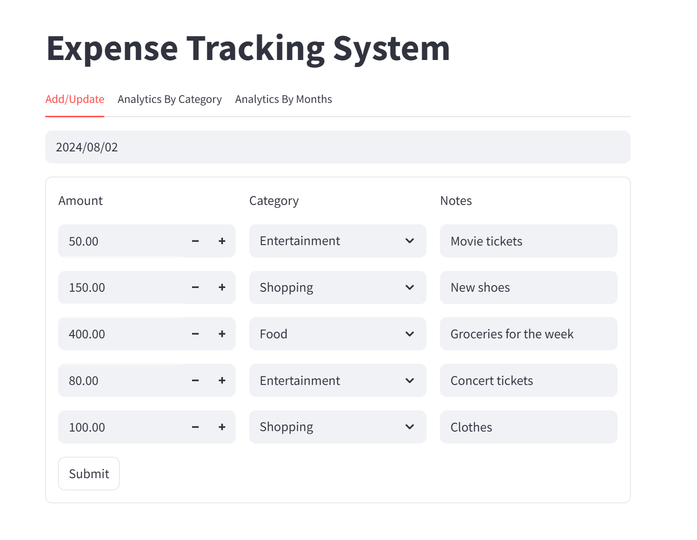
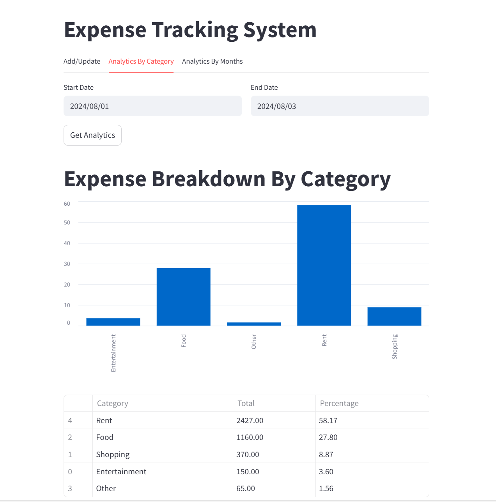
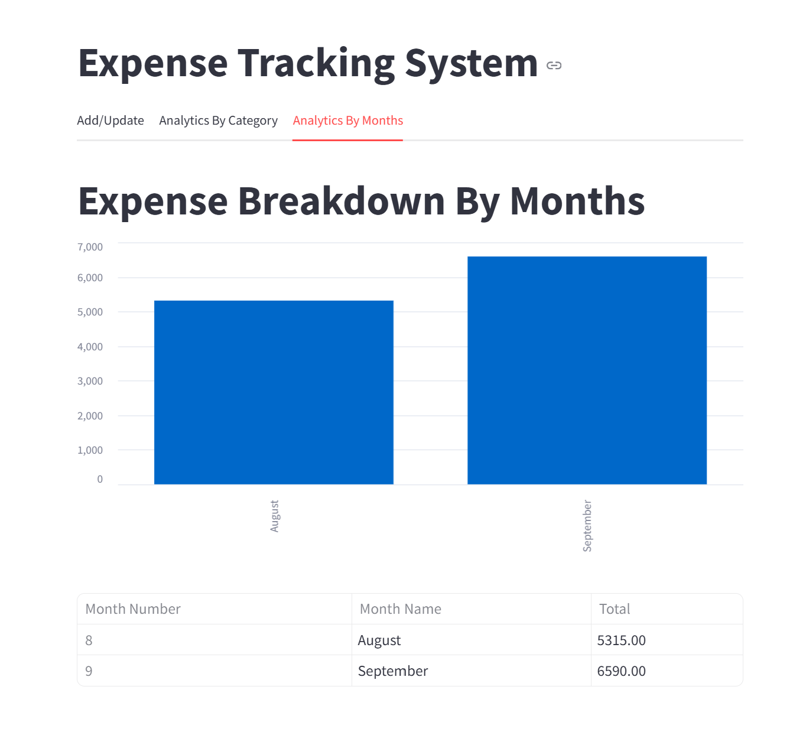

# 💸 Expense Management System

An efficient and user-friendly **Expense Management System** built with **FastAPI** for the backend and **Streamlit** for the frontend. This application allows users to track, manage, and visualize expenses with ease.

---

## 🗂 Project Structure

```
PROJECT_EXPENSE_TRACKING_SYSTEM/
├── backend/               # FastAPI server and database helpers
├── frontend/              # Streamlit user interface
├── tests/                 # Unit tests for backend and frontend
├── requirements.txt       # Python dependencies
└── README.md              # Project documentation
```

---

## 🚀 Features

- 📊 Add, edit, and delete expenses
- 📅 Track expenses over time
- 📈 Visualize spending through charts and summaries
- 🧩 Modular structure for easy maintenance and scalability
- 🧪 Unit tests for code reliability

---

## 🛠️ Technologies Used

- **Frontend**: [Streamlit](https://streamlit.io/)
- **Backend**: [FastAPI](https://fastapi.tiangolo.com/)
- **Database**: SQLite (via `db_helper.py`)
- **Testing**: Pytest
- **Other**: Logging utilities, REST API endpoints

---

## ⚙️ Setup Instructions

1. **Clone the Repository**
   ```bash
   git clone https://github.com/DeviPravallikaKarry/expense-management-system
   cd expense-management-system
   ```

2. **Install Dependencies**
   ```bash
   pip install -r requirements.txt
   ```

3. **Run the Backend Server**
   ```bash
   uvicorn backend.server:app --reload
   ```

4. **Run the Frontend (Streamlit App)**
   ```bash
   streamlit run frontend/app.py
   ```

---

## 🧪 Running Tests

```bash
pytest tests/
```

---

## 🖼️ Screenshots

### 🧾 Add/Update Tab
This screen allows users to **add new expenses or update existing ones**. It includes fields such as amount, date, category, and description.


---

### 📊 Analytics by Category Tab
Displays **expense distribution by category**, helping users understand where most of their money is going (e.g., Food, Transport, Rent).


---

### 📈 Analytics by Month Tab
Shows **monthly expense trends**, useful for identifying patterns and tracking financial progress over time.


---

## ✅ Conclusion

This Expense Management System provides a robust foundation for tracking and analyzing personal finances. With a modular architecture using FastAPI and Streamlit, it's designed for both simplicity and scalability. Whether you're managing your own budget or building a finance tool for others, this project offers a solid starting point for further development and customization.

---

## ⭐ Like this project?

If you found this Expense Management System useful or inspiring, feel free to **star** the repository and **explore the source code**.

